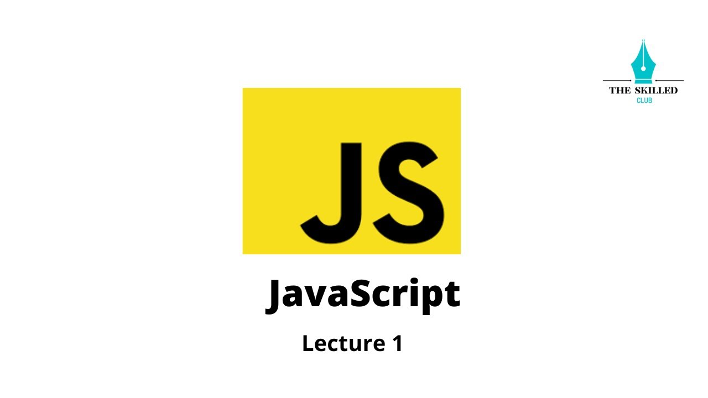
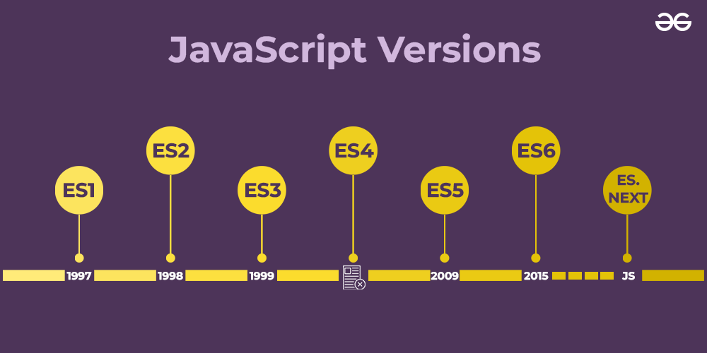
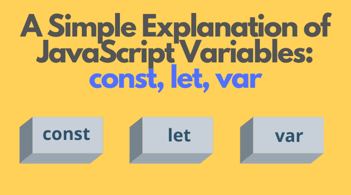
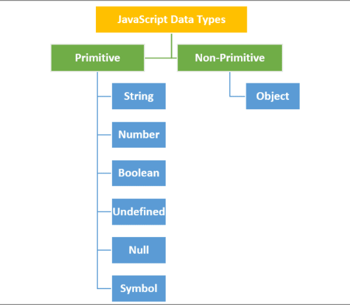
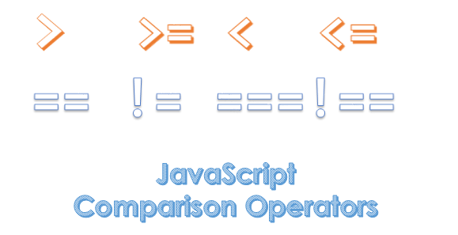
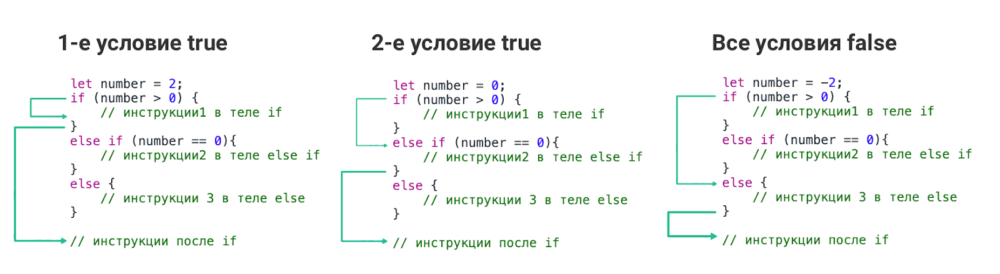

 
``JAVASCRIPT``
=====================
## Javascript is a most popular programming language in the world
______________________
    Javascript was used mainly for making webpages interactive such as:
* validation
* animation 
------------------------
# ``A Brief history of JavaScript``
  ;
# ``Brendan Eich``

###  Brendan Eich creates the very first version of javascript in just 10 days in 1995. It was called Mocha.
------------------------
### Mocha changes to LiveServer 1996.  
### Microsoft launches IE, copying JavaScript from NetScape and calling it JScript; 
________________________

# ``Javascript releases``
    The biggest update in the language  Javascript be ES6 in 2015
_____________________________

# ``JavaScript Variables and Constants``
## 1.-VAR          
## 2.-LET
## 3.-CONST
--------------------
    In Javascript there is two types of intializing variables, VAR and LET.
     You can use both of them. 
    However, there are some differences between them.

________________________________________
    Javascript If you are sure that the value of a variables won't change throughout the
     program, it's recommended to use CONST.
--------------------------
# ``JAVASCRIPT OBJECTS AND PRIMITIVES``

_____________________________
# ``OPERATORS IN JAVASCRIPT``

______________________
# ``JAVASCRIPT CONDITION  IF/ELSE STATEMENT``

* First condition is true 
* Second condition is true 
* All conditions are false
________________

